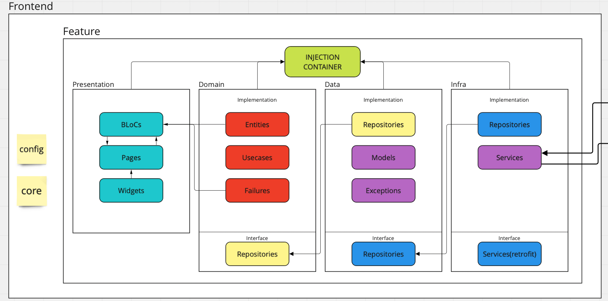
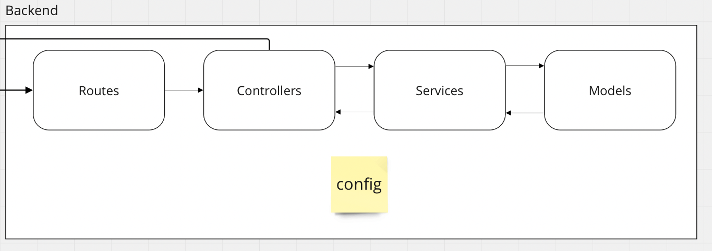
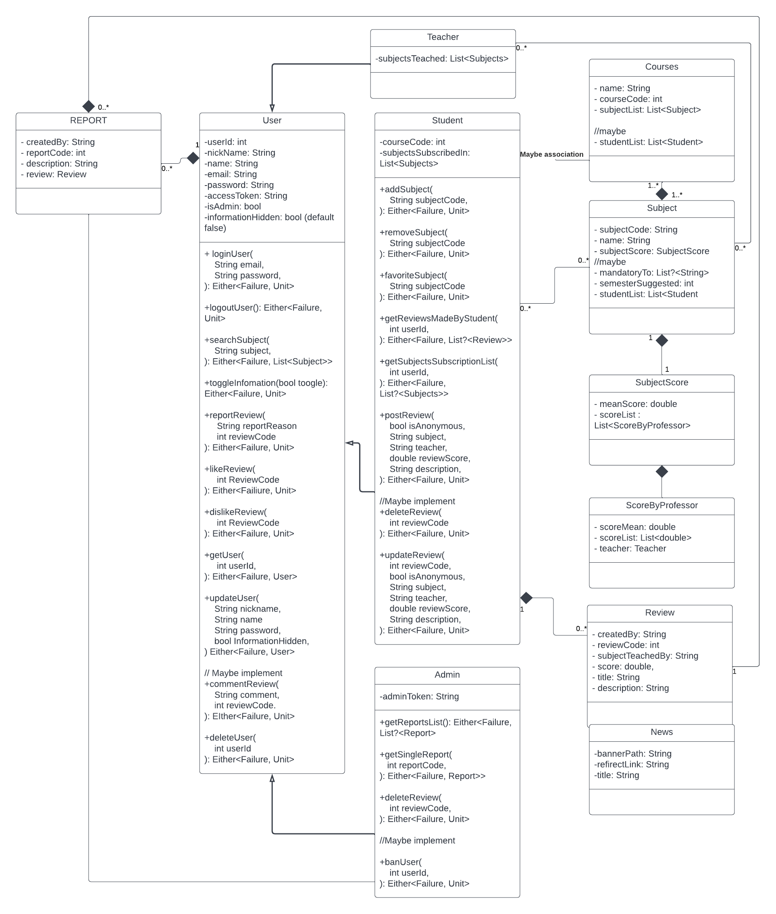
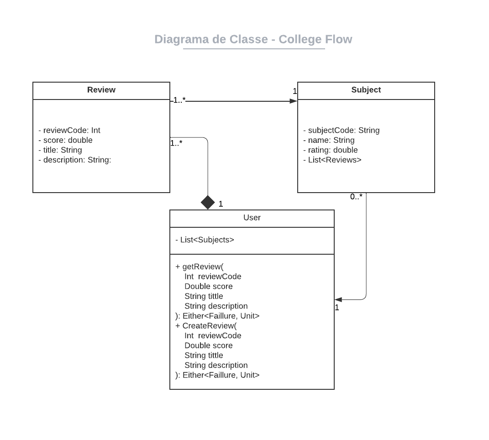
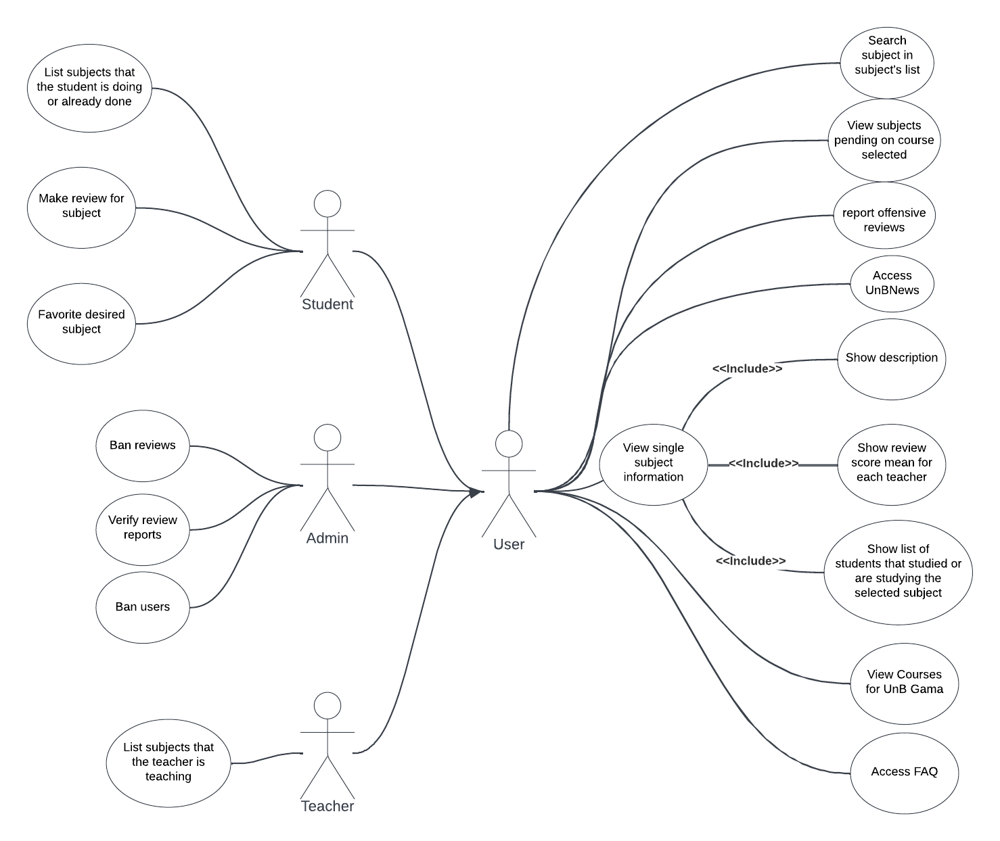

# Documento de arquitetura

## Histórico de revisão

| Data       | Versão | Modificação                   | Autor            |
| :--------- | :----- | :---------------------------- | :--------------- |
| 07/06/2022 | 0.1    | Abertura do documento         | Maurício Machado |
| 26/06/2022 | 1.0    | Edição do documento           | Maurício Machado |
| 05/09/2022 | 2.0    | Edição do documento           | Luan Melo        |
| 05/09/2022 | 3.0    | Edição do escopo do documento | Lucas Macedo     |

## 1. Introdução

### 1.1 Finalidade

Este documento tem como objetivo descrever a arquitetura do collegeFlow app. Aqui será apresentada a interação do mobile com o backend e por sua vez o backend e a database. Esse documento oferece também uma visão geral arquitetural do sistema que será implementado, permitindo assim que os envolvidos no projeto conheçam como a aplicação será subdivida e quais serão as funções de cada componente.

### 1.2 Escopo

O collegeFlow app consiste em um aplicativo para a UnB campus Gama. Sua intenção é facilitar a escolha de matérias através da experiência de outros usuários. Isso será feito mediante, listagem das matérias, apresentação de quais professores dão essa matéria e a respectiva avaliação do professor e da matéria.

## 2. Representação arquitetural

O modelo de arquitetura proposto nesse projeto é um modelo multicamada, onde é divido em três frentes principais:

- A camada de persistência, onde engloba o banco de dados não-relacional MongoDB.
- A camada de manipulação e tratamento de dados, usando o framework ExpressJS.
- Camada de visualização dos dados, responsável por renderizar todos os dados manipulados na camada de tratamento e lidar diretamente com o usuário final.

Para realizar a comunicação entre as camadas, será utilizado o modelo de arquitetura cliente-servidor, no qual há os fornecedores de recursos e os que consomem esses recursos disponibilizados. O servidor é um fornecedor de recurso, onde é uma camada intermediária responsável por lidar diretamente com os a camada de persistência e fornecer os dados manipulados para a camada de visualização dos dados através do protocolo de comunicação HTTP. O Cliente nesse ecossistema usufrui dos dados fazendo requisições ao servidor e renderizando estes para os usuários que fizeram a requisição.

### Diagrama de relação

### Camada **INFRA**

Sua função é contatar o backend e conseguir o dado cru para poder ser usado na aplicação.

### Camada **DATA**

Responsabilidade dessa camada é tratar o dado cru que é obtido pelos datasources. Esse dado cru é então transformado nas models através de serialização - exemplo, [json_serializable](https://fga-eps-mds.github.io/CollegeFlow/). Esse processo também pode ser analisado de outro ponto onde levamos informação da aplicação para o backend. Nesse ponto teremos a deserialização dos dados.

Essa camada possui também a implementação das abstrações da camada de domain. A camada data depende da domain mas o inverso não é verdade.

### Camada **PRESENTATION**

Contém duas partes importantes: BLoCs e UI. Combinados elas fazem a camada de visualização de conteúdo dinâmico na aplicação.

O BLoC ajuda o em executrar interações que precise de dados fora do contexto da UI. Além disso permite o gerenciamento de estado dos widgets de forma mais separada e organizada através da seguinte quebra: **bloc, event, state**.
A UI é a implementação do design das páginas e coordenação de recebimento de valores.

### Camada **DOMAIN**

Contém apenas entidades internas o que significa que nosso domínio é independente de mudanças que acontecem fora dessa camada.
Aqui definimos nossos usecases, classes individuais que performam uma ação precisa na aplicação (post de alguma info, login do usuário e etc). No caso de necessidade de vários usecases podemos criar uma rotina que faz uso desses usecases específicos.

### **Node.js**

Node.js é uma plataforma para construir aplicações web escaláveis de alta performance usando JavaScript do tipo server side, não dependendo de um browser para sua execução. Ele foi construído em cima da engine V8 que interpreta JavaScript, criado pela Google e usado em seu navegador, o Chrome.

### **MongoDB**

O banco de dados escolhido para o projeto foi o MongoDB, pela sua alta performance, a sua imensa comunidade em seu ecossistema e uma ótima documentação para sua implantação.

### **Express js**

Para a parte do Backend, será usado o framework express juntamente com o nodeJs, pela sua grande performance e flexibilidade, onde o próprio desenvolvedor tem a liberdade de definir a arquitetura do projeto. O express conta com todo o sistema de gerenciamento de rotas, utilitários HTTPs e gerenciamento de middlewares, o que é de grande ajuda para desenvolver aplicações do tipo REST e aplicações WEBs monolíticas.

A responsabilidade desse framework é atuar como a camada de manipulação dos dados, sendo a API do projeto. A arquitetura usada no Backend será a MC, derivada da arquitetura MVC. Nesse caso não existe a View para essa camada, pois esta tem a única responsabilidade de fazer o interfaceamento e manipulação de dados entre a camada de persistência e View da projeto.

### **DIO**

Requisições HTTP são um dos principais recursos usados no desenvolvimento web e mobile, já que são necessárias para acessar o servidor de nossas aplicações, banco de dados, entre outros.

DIO é um pacote do Flutter que proporciona um poderoso clietne HTTP. Além disso suporta Interceptors, Global configuration, FormData, Request Cancellation, File Downloading, Timeout etc.

## 3. Metas e Restrições arquiteturais

3.1 Suportabilidade

A aplicação poderá ser utilizada sem problemas para o sistema operacional android e se possível para o IOS.

3.2 Usabilidade

O sistema deverá ser intuitivo e de simples uso, de forma que a curva de aprendizado para utilizar a aplicação não seja um impedimento para usar o sistema.

3.3 Ferramentas de Desenvolvimento

O projeto será desenvolvido em Flutter, utilizando a versão 3.0.4, em conjunto com o framework node, um framework JavaScript para criação de servidores juntamente com o Express.js.

Para facilitar a portabilidade do projeto, tanto para o ambiente de deploy quanto para os ambientes de desenvolvimento, será utilizado o Docker para realizar o empacotamento da aplicação.

3.4 Confiabilidade

O sistema terá uma cobertura mínima de testes de 40%, buscando garantir certo nível de teste.

## 4. Visão de Implantação

A implementação do Software será realizado por etapas, visando a utilização do software durante o desenvolvimento de novas funções, possibilitando um uso antecipado de funções já desenvolvidas.

### 4.1 Diagrama de Classe

- tendo em vista a complexidade do projeto em relação ao semestre, o projeto sofreu alteração no escopo do projeto

### 4.2 Diagrama de Casos de Uso

- tendo em vista a complexidade do projeto em relação ao semestre, o projeto sofreu alteração no escopo do projeto

## Referências

Documentação do Node.js. Disponível em: <https://nodejs.org/en/docs/>. Acesso em 25 de julho de 2022.
Documentação Flutter. Disponível em <https://docs.flutter.dev>. Acesso em 25 de julho de 2022.
MVC com node.js. Disponível em: <https://irias.com.br/blog/mvc-conceito-e-exemplo-em-node-js/>. Acesso em 25 de julho de 2022.
Clean architecture in flutter part 1. Disponível em: <https://irias.com.br/blog/mvc-conceito-e-exemplo-em-node-js/>.
Imprivng workflow with clean architectue. Disponível em: <https://irias.com.br/blog/mvc-conceito-e-exemplo-em-node-js/>.
Express js documentação. Disponível em <https://expressjs.com/en/starter/basic-routing.html>. Acesso em 25 de julho de 2022.

[1] - Andrew Pinkham. Livro. Disponível em: <https://django-unleashed.com>. Acesso em: 12 de setembro de 2019.
